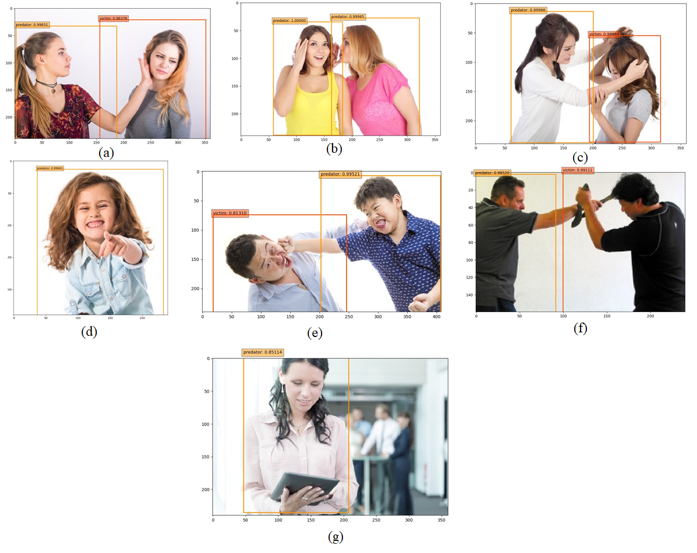

# bullyssd

A deep learning model that detects the cyberbullying victim and predator from images. 

### Project Group Members

Mhafuzul Islam (mdmhafi@clemson.edu)

Zadid Khan (mdzadik@clemson.edu)

# Project Description
In the first part of the project, we implemented an image classification model “BullyNet”, that classifies the type of bullying in the image. In the second part, we used VGG-16 as the backbone to implement SSD (Single-Shot Multibox Detector) convolution neural network (CNN) model. This model puts bounding boxes around all persons in an image and classifies them into 3 categories.
1)	Victim- A person who is directly being affected by the bullying.
2)	Predator- A person who is performing the bullying action.
3)	Neutral- All other persons who are not involved in any type of bullying activities.

SSD contains shallow layers to predict small objects and deeper layers to predict bigger objects, as small objects don’t need bigger receptive fields and bigger receptive fields can be confusing for small objects.

# How to run the model:
1. Download the trained file from this link:  [link-to-trained-model](https://drive.google.com/drive/folders/1XwtduucPHfSjpfUam3o3jCQ3qBgeZmti?usp=sharing)
2. The donwloaded file shound be in the name ```bullynet.pth```, and Place the trained weight file in ```weights``` folder.
2. We have created a Python script "test.py" that reads the path to an image file from the command line and outputs the type of cyberbullying in the image.

Run the following command to test the output. The output will be a single image ```predicted.jpg``` indicating victim, predator or neutral using a bounding box.

```python test.py image_name.jpg```

# Sample Output:

# References

* Karen Simonyan, Andrew Zisserman "Very Deep Convolutional Networks for Large-Scale Image Recognition"
* Wei Liu, Dragomir Anguelov, Dumitru Erhan, Christian Szegedy, Scott Reed, Cheng-Yang Fu, Alexander C. Berg  "SSD: Single Shot MultiBox Detector"
